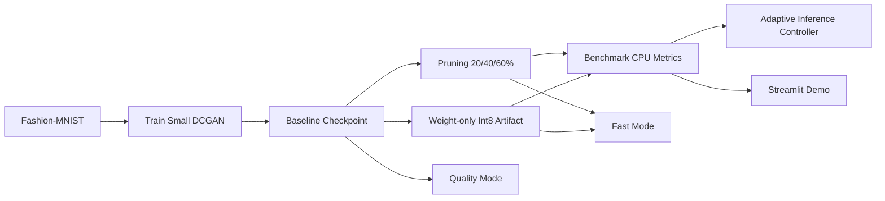

# EdgeGen

Edge-Deployable Generative AI with Compression and Adaptive Inference

## Motivation

Edge deployment of generative models is constrained by CPU-only execution, limited memory, and tight latency budgets. EdgeGen is a research-style prototype that demonstrates a compact end-to-end pipeline: train a lightweight DCGAN on Fashion-MNIST, compress it with pruning, serialize an honest weight-only quantized artifact, benchmark deployment metrics, and switch between fast and quality inference modes.

## Prototype Architecture



## Project Layout

```text
edgegen/
  README.md
  requirements.txt
  configs/base.yaml
  models/dcgan.py
  training/train_gan.py
  compression/prune.py
  compression/quantize.py
  inference/generate.py
  inference/adaptive_infer.py
  inference/compare_models.py
  benchmark/benchmark.py
  utils/metrics.py
  utils/io.py
  utils/seed.py
  app/streamlit_app.py
  outputs/
    checkpoints/
    samples/
    benchmarks/
```

## Setup

```bash
cd /Users/soham/Downloads/prototype2/edgegen
python3 -m venv .venv
source .venv/bin/activate
pip install -r requirements.txt
```

## Exact Run Commands

### Train

```bash
cd /Users/soham/Downloads/prototype2/edgegen
python training/train_gan.py --epochs 100 --batch_size 128 --latent_dim 100 --lr 0.0002 --sample_every 10 --seed 42
```

### Prune

```bash
cd /Users/soham/Downloads/prototype2/edgegen
python compression/prune.py --checkpoint outputs/checkpoints/best.pt --ratios 0.2 0.4 0.6
```

### Quantize

```bash
cd /Users/soham/Downloads/prototype2/edgegen
python compression/quantize.py --checkpoint outputs/checkpoints/best.pt
```

### Benchmark

```bash
cd /Users/soham/Downloads/prototype2/edgegen
python benchmark/benchmark.py --batch_size 32 --warmup_iters 5 --measure_iters 20
```

### Generate Comparison Images

```bash
cd /Users/soham/Downloads/prototype2/edgegen
python inference/compare_models.py --num_samples 16 --seed 42
```

### Adaptive Inference

```bash
cd /Users/soham/Downloads/prototype2/edgegen
python inference/adaptive_infer.py --latency_budget_ms 10
python inference/adaptive_infer.py --latency_budget_ms 50
```

### Demo UI

```bash
cd /Users/soham/Downloads/prototype2/edgegen
streamlit run app/streamlit_app.py
```

## Training and Compression Details

- Generator: latent dimension configurable, ConvTranspose-based upsampling to 28x28, BatchNorm + ReLU + Tanh.
- Discriminator: small convolutional classifier with LeakyReLU, BatchNorm, and sigmoid output.
- Pruning: global magnitude-based unstructured pruning at 20%, 40%, and 60%.
- Quantization: weight-only int8 artifact compression for generator weights. This is an honest fallback because ConvTranspose layers do not have broadly reliable native CPU int8 execution in standard PyTorch eager deployment.
- Quality mode in the UI always uses the strongest baseline checkpoint, `outputs/checkpoints/best.pt`, when it exists.

## Benchmark Metrics

Benchmarking measures:

- model artifact size in MB
- average latency per batch
- throughput in samples per second
- peak memory via `psutil`
- prototype-level quality score from handcrafted feature distance

`outputs/benchmarks/results.csv`, `outputs/benchmarks/summary.md`, and `outputs/benchmarks/professor_summary.md` are generated automatically.

## Experiment Result Template

| Model | Size (MB) | Avg Latency (ms) | Throughput (samples/s) | Peak Memory (MB) | Feature Distance | Quality Score |
|---|---:|---:|---:|---:|---:|---:|
| baseline | TBD | TBD | TBD | TBD | TBD | TBD |
| pruned_20 | TBD | TBD | TBD | TBD | TBD | TBD |
| pruned_40 | TBD | TBD | TBD | TBD | TBD | TBD |
| pruned_60 | TBD | TBD | TBD | TBD | TBD | TBD |
| best_pruned | TBD | TBD | TBD | TBD | TBD | TBD |
| quantized | TBD | TBD | TBD | TBD | TBD | TBD |

## Quality Evaluation Note

This is a prototype-level quality evaluation. The project uses a handcrafted feature-distance heuristic rather than a full FID or human study. Qualitative sample grids are also saved for visual inspection.

## Outputs

- Checkpoints: `outputs/checkpoints/`
- Sample images: `outputs/samples/`
- Comparison images: `outputs/samples/comparisons/`
- Benchmark reports: `outputs/benchmarks/`

## Limitations

- Fashion-MNIST is a simple grayscale dataset and does not reflect large-scale generative deployment.
- GAN convergence on CPU is intentionally lightweight and optimized for demonstration rather than maximum fidelity.
- Quantized inference is artifact-focused because ConvTranspose int8 runtime support is limited.
- Quality evaluation is heuristic and should not be treated as a publishable fidelity metric.

## Future Work

- Layer-specific pruning
- Low-data generative training
- Diffusion extension
- Raspberry Pi / Jetson deployment
